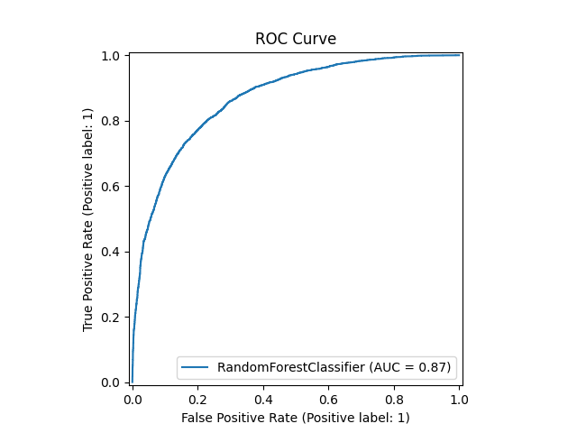
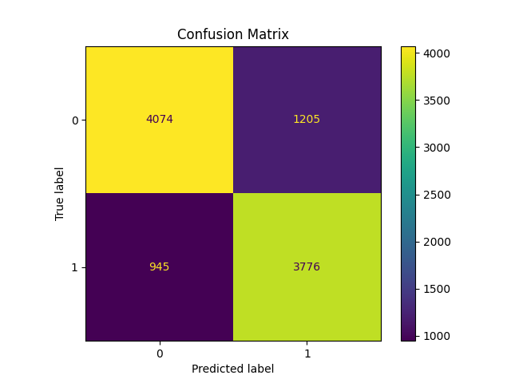
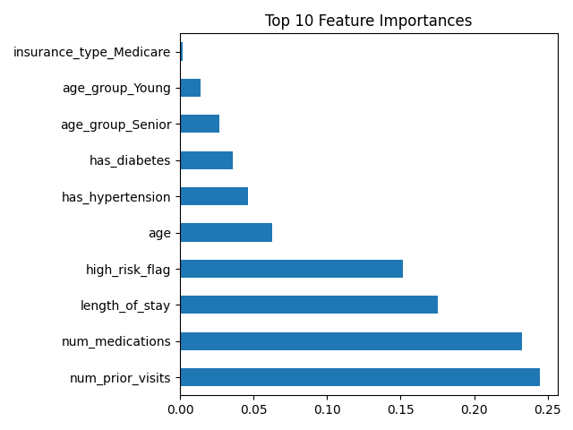

# Healthcare Readmission Risk Pipeline  
### PySpark + Machine Learning + FastAPI

## Overview

This project builds an end-to-end healthcare analytics pipeline to predict 30-day hospital readmission risk using PySpark, SQL analytics, machine learning, and API deployment.

The project simulates a real-world healthcare data science workflow, including data ingestion, ETL processing, feature engineering, exploratory analytics, predictive modeling, model evaluation, and real-time inference through a FastAPI application.

The goal is to demonstrate how data science can support healthcare decision-making by identifying high-risk patients earlier and enabling more proactive operational planning.

---

## Business Problem

Hospital readmissions are costly and can indicate gaps in care coordination, discharge planning, or patient follow-up. Healthcare organizations need reliable ways to identify patients at higher risk of readmission within 30 days.

This project addresses that problem by building a predictive analytics pipeline that estimates readmission risk based on patient, financial, satisfaction, and operational features.

---

## Key Features

- End-to-end PySpark ETL pipeline for scalable data processing  
- Spark SQL analytics for healthcare business insights  
- Feature engineering for predictive modeling  
- Random Forest classification model  
- Model evaluation using accuracy, classification report, confusion matrix, and ROC-AUC  
- ROC-AUC score: **0.86**  
- FastAPI application for real-time readmission risk prediction  
- Clean project structure for portfolio and production-style development  

---

## Tech Stack

- Python  
- PySpark  
- Spark SQL  
- Scikit-learn  
- FastAPI  
- Pandas  
- NumPy  
- Joblib  
- Matplotlib  

---

## Project Structure

```text
healthcare-readmission-risk-pipeline/
│
├── data/
│   └── raw/
│       └── healthcare_readmission.csv
│
├── models/
│   └── readmission_model.pkl
│
├── src/
│   ├── api.py
│   ├── generate_healthcare_data.py
│   ├── pyspark_etl.py
│   ├── spark_analysis.py
│   └── train_model.py
│
├── outputs/
│   ├── figures/
│   └── reports/
│
├── README.md
├── requirements.txt
└── .gitignore

```
## Data Pipeline
```text
The pipeline follows a structured data science workflow:

Raw Healthcare Data
        ↓
PySpark ETL Processing
        ↓
Data Cleaning & Feature Engineering
        ↓
Spark SQL Analytics
        ↓
Machine Learning Model Training
        ↓
Model Evaluation
        ↓
FastAPI Deployment
        ↓
Real-Time Prediction
```

## Machine Learning Approach

A Random Forest classification model was trained to predict whether a patient is at risk of 30-day readmission.

The modeling workflow includes:

Data preprocessing
Feature selection
Train-test split
Random Forest model training
Model evaluation
Model serialization for API deployment


## Results

The model achieved strong predictive performance:
ROC-AUC: 0.8566
Accuracy: 0.77

The ROC-AUC score indicates the model can effectively distinguish between patients who are likely to be readmitted and those who are not.
## ROC Curve



## Confusion Matrix


## Feature Impotance


## API Deployment

The trained model is deployed with FastAPI for real-time prediction.

Example API use case:
Input: Patient and operational features
Output: Predicted readmission risk

This demonstrates how machine learning models can be integrated into healthcare decision-support systems.

## Business Value

This project demonstrates how healthcare organizations can use predictive analytics to:

Identify high-risk patients earlier
Improve care coordination
Support discharge planning
Prioritize follow-up resources
Reduce avoidable readmissions
Enable data-driven healthcare operations
Future Improvements
Add SHAP explainability for model interpretation
Deploy the API with Docker
Add a Streamlit or Power BI dashboard
Integrate cloud storage or AWS deployment
Add automated model monitoring
Expand features with additional clinical or operational variables

## Author

Mohammad Samad
Data Scientist | AI & Operational Intelligence | Predictive Analytics | Operations Research
